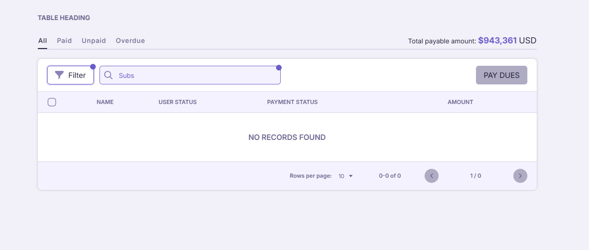
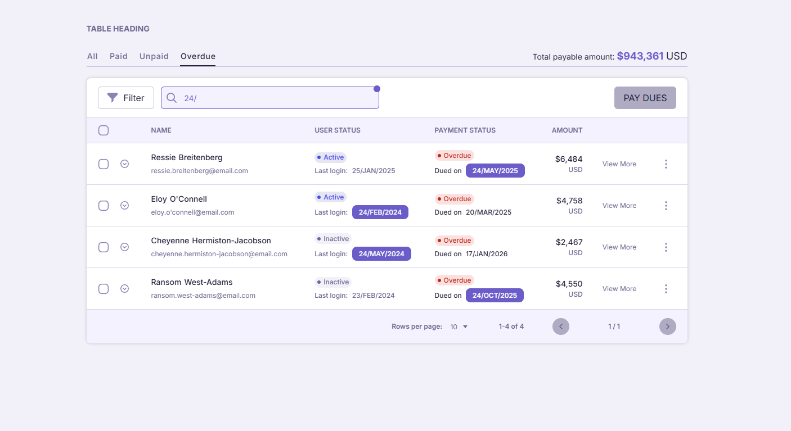
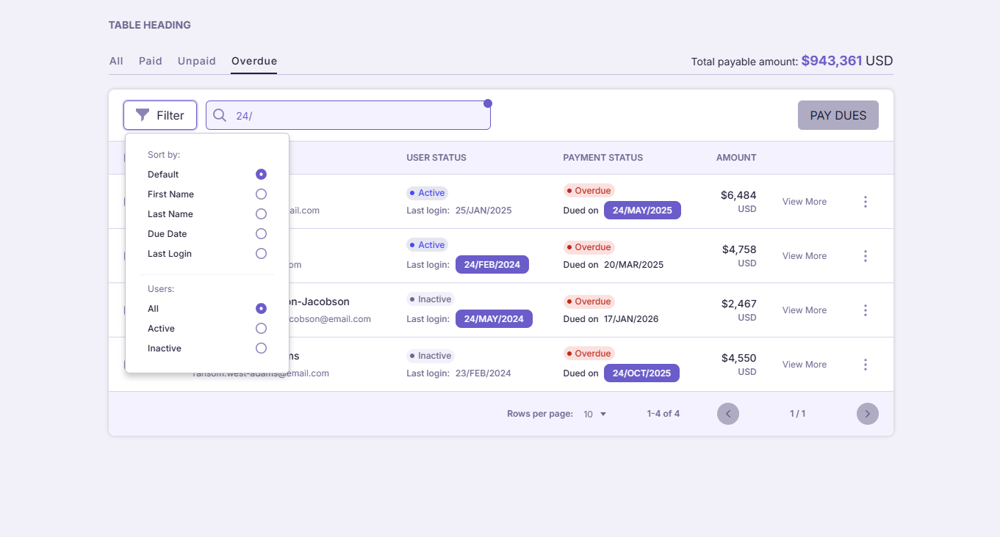
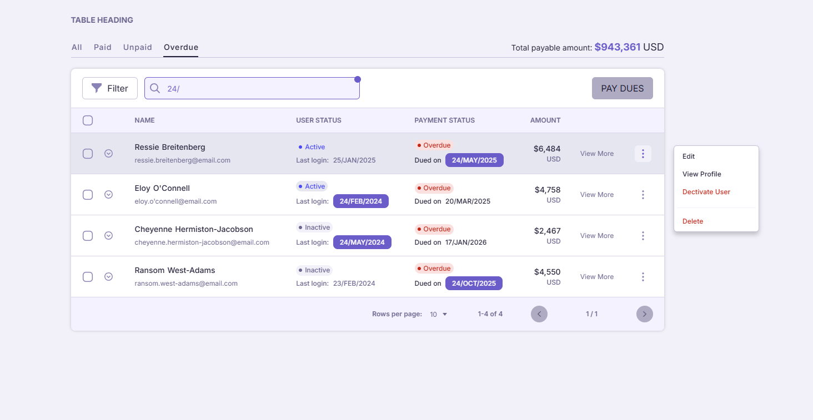
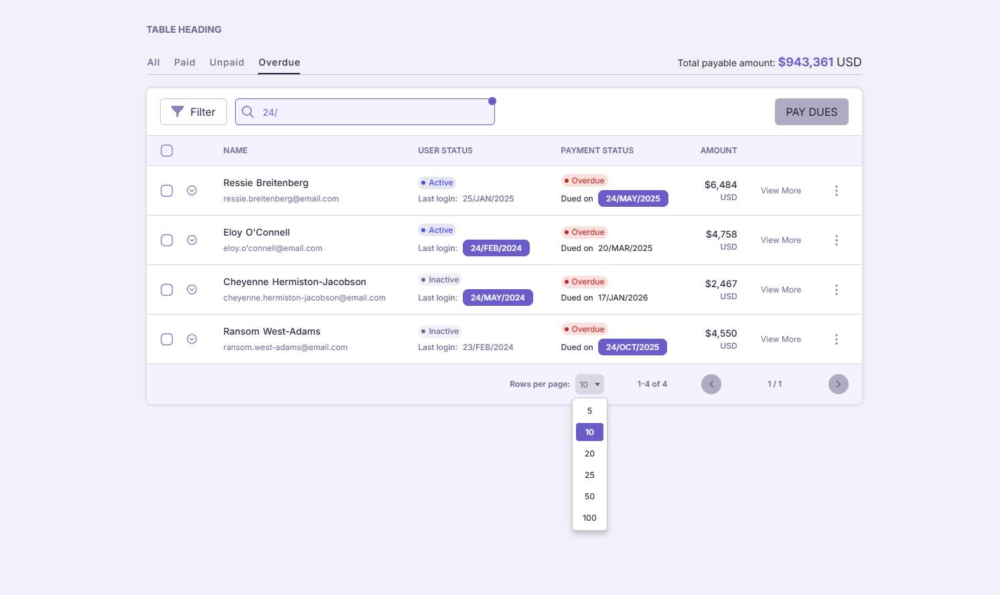
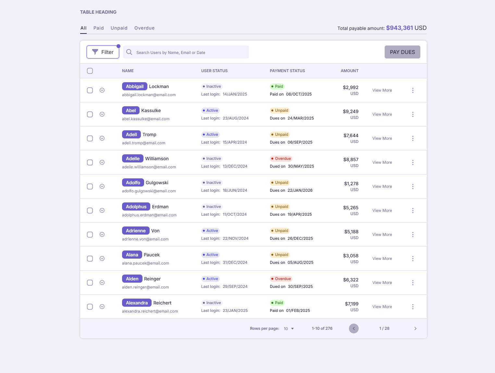
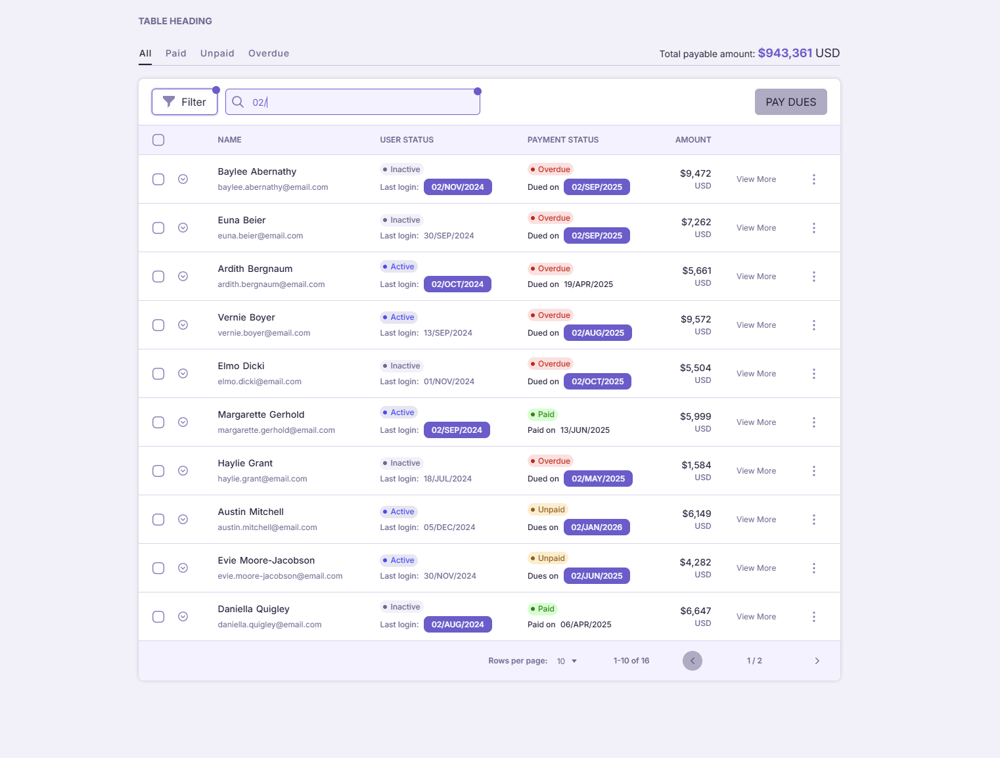

# Scelloo Vue3.js|Nuxt3.js Starter

## Description

This project is built on vue.js (Nuxt3) and uses tailwind, scss and vuetify for styling and components as well as v-auto-animate for animation and vue inbuilt animation tags. the faker packeged is used to generate new sets of data while a logical function adds the rest of the data.

Links to packages are listed at the bottom.

Look at the [Nuxt 3 documentation](https://nuxt.com/docs/getting-started/introduction) to learn more.

## Requirement

- Node 20+
- Npm

## Setup

Make sure to install the dependencies first:

```bash
# npm
npm install

# pnpm
pnpm install

# yarn
yarn install

# bun
bun install
```

## Development Server

Start the development server on `http://localhost:3000`:

```bash
# npm
npm run dev

# pnpm
pnpm run dev

# yarn
yarn dev

# bun
bun run dev
```

## Production

Build the application for production:

```bash
# npm
npm run build

# pnpm
pnpm run build

# yarn
yarn build

# bun
bun run build
```

Locally preview production build:

```bash
# npm
npm run preview

# pnpm
pnpm run preview

# yarn
yarn preview

# bun
bun run preview
```

## Visuals
















## Structure

```
Root/
├── assets/
│   ├── fonts/
│   ├── images/
│   ├── styles/
│   │   ├── main.scss
│   │   ├── reusable.scss
│   │   └── variables.scss
├── components/
│   ├── table/
│   │   ├── Area.vue
│   │   └── Status.vue
│   ├── BaseButton.vue
│   ├── BaseCheck.vue
│   ├── TableFilter.vue
│   └── TablePagination.vue
├── composables/
│   ├── useAppResourceStore.ts
│   ├── useCustomLoadingIndicator.ts
│   ├── useEventBus.ts
│   └── userAccountInfoStore.ts
├── layouts/
│   ├── default.vue
│   └── error.vue
├── libs/
│   └── someLibrary.ts
├── pages/
│   ├── index.vue
│   ├── about.vue
│   └── contact.vue
├── plugins/
│   ├── autoanimate.ts
│   ├── helpers.ts
│   ├── vuetify.ts
│   └── [addMorePLugin].ts
├── public/
│   ├── images/
│   ├── svgs/
│   └── screenshort1.jpeg
├── server/
│   ├── api/
│   │   ├── index.ts
│   │   └── user.ts
│   └── middleware/
│       └── auth.ts
├── stores/
│   ├── appResourceStore.ts
│   └── userAccountInfoStore.ts
├── types/
│   └── global.d.ts
├── utils/
│   ├── defaultVals.ts
│   └── [someUtil].ts
└── README.md
```

## Useful Links

1. <a href="https://scelloo-blitz.netlify.app/" target="_blank">Deployment</a>
2. <a href="https://fakerjs.dev/guide/" target="_blank">Faker.js</a>
3. <a href="https://auto-animate.formkit.com/#installation" target="_blank">Auto-animate</a>
4. <a href="https://pinia.vuejs.org/" target="_blank">Pinia</a>
5. <a href="https://tailwindcss.nuxtjs.org/" target="_blank">Tailwind-nuxt - Quick and useful styling</a>
6. <a href="https://vuetifyjs.com/" target="_blank">Vuetify - Component library</a>

Visit the <a href="https://scelloo-blitz.netlify.app/" target="_blank">deployment</a> for a live preview.
